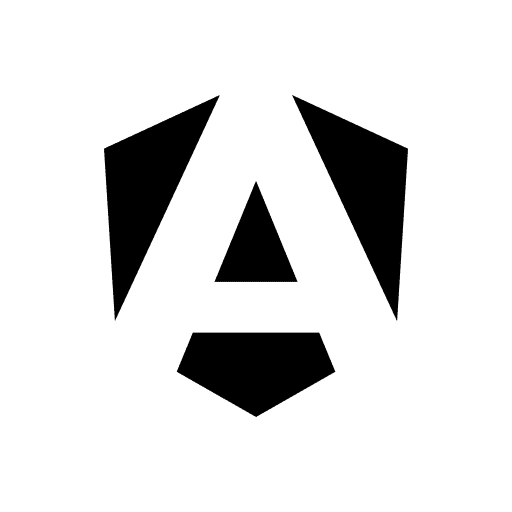
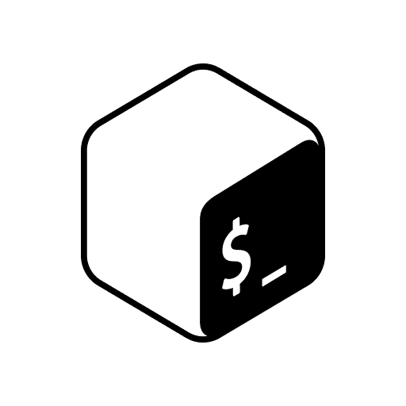
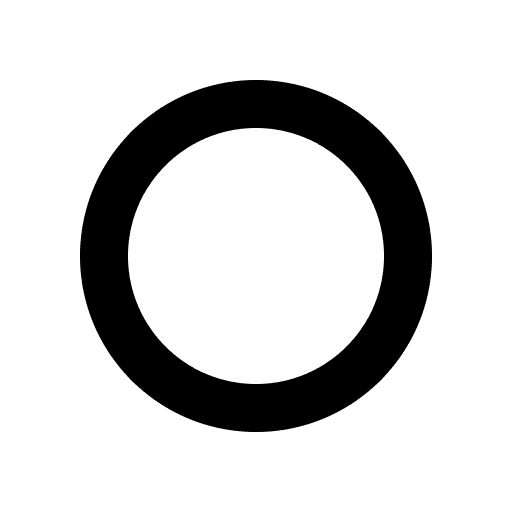
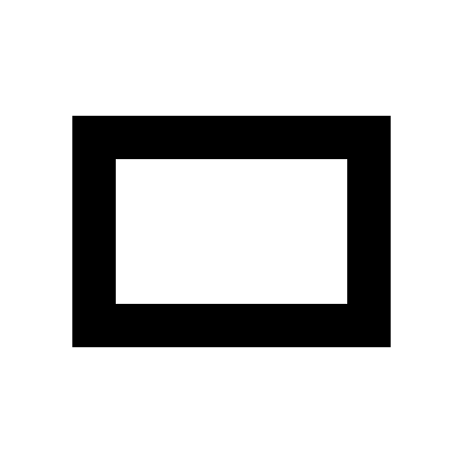
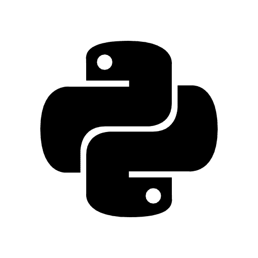
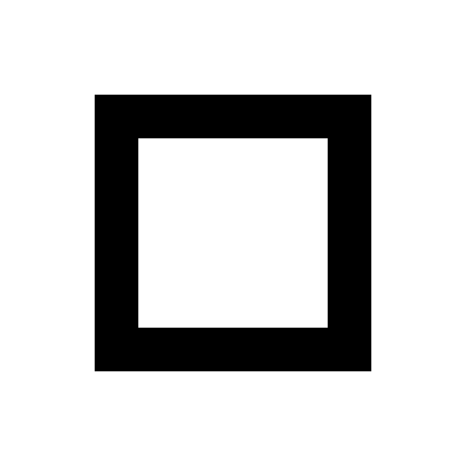
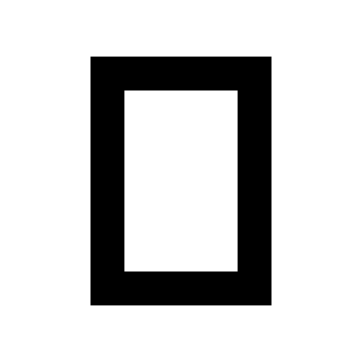

<div align="center">
  <p></p>
  <h1>LOGOBASE</h1>
</div>

<table><tr><td align="center" width="9999">
  &nbsp;<p>Technology logo pack intended for very seamless integration into README.md files or visual assets such as LinkedIn banners, provided in both dark and light variants for optimal flexibility and consistency.</p>&nbsp;
</td></tr></table>

### Logo Collection

<!-- START_TABLE -->
<table>
  <tbody><tr>
    <td align="center" width="9999"><p><a href="logos/android-light.png"><picture><source media="(prefers-color-scheme: dark)" srcset="logos/android-dark.png"></picture></a></p></td>
    <td align="center" width="9999"><p><a href="logos/angular-light.png"><picture><source media="(prefers-color-scheme: dark)" srcset="logos/angular-dark.png"></picture></a></p></td>
    <td align="center" width="9999"><p><a href="logos/apple-light.png"><picture><source media="(prefers-color-scheme: dark)" srcset="logos/apple-dark.png"></picture></a></p></td>
    <td align="center" width="9999"><p><a href="logos/bash-light.png"><picture><source media="(prefers-color-scheme: dark)" srcset="logos/bash-dark.png"></picture></a></p></td>
    <td align="center" width="9999"><p><a href="logos/buymeacoffee-light.png"><picture><source media="(prefers-color-scheme: dark)" srcset="logos/buymeacoffee-dark.png"></picture></a></p></td>
  </tr></tbody>
  <tbody><tr>
    <td align="center" width="9999"><p><a href="logos/circle-light.png"><picture><source media="(prefers-color-scheme: dark)" srcset="logos/circle-dark.png"></picture></a></p></td>
    <td align="center" width="9999"><p><a href="logos/docker-light.png"><picture><source media="(prefers-color-scheme: dark)" srcset="logos/docker-dark.png"></picture></a></p></td>
    <td align="center" width="9999"><p><a href="logos/figma-light.png"><picture><source media="(prefers-color-scheme: dark)" srcset="logos/figma-dark.png"></picture></a></p></td>
    <td align="center" width="9999"><p><a href="logos/flutter-light.png"><picture><source media="(prefers-color-scheme: dark)" srcset="logos/flutter-dark.png"></picture></a></p></td>
    <td align="center" width="9999"><p><a href="logos/github-actions-light.png"><picture><source media="(prefers-color-scheme: dark)" srcset="logos/github-actions-dark.png"></picture></a></p></td>
  </tr></tbody>
  <tbody><tr>
    <td align="center" width="9999"><p><a href="logos/github-sponsors-light.png"><picture><source media="(prefers-color-scheme: dark)" srcset="logos/github-sponsors-dark.png"></picture></a></p></td>
    <td align="center" width="9999"><p><a href="logos/gradle-light.png"><picture><source media="(prefers-color-scheme: dark)" srcset="logos/gradle-dark.png"></picture></a></p></td>
    <td align="center" width="9999"><p><a href="logos/horizontal-light.png"><picture><source media="(prefers-color-scheme: dark)" srcset="logos/horizontal-dark.png"></picture></a></p></td>
    <td align="center" width="9999"><p><a href="logos/intellij-light.png"><picture><source media="(prefers-color-scheme: dark)" srcset="logos/intellij-dark.png"></picture></a></p></td>
    <td align="center" width="9999"><p><a href="logos/ios-light.png"><picture><source media="(prefers-color-scheme: dark)" srcset="logos/ios-dark.png"></picture></a></p></td>
  </tr></tbody>
  <tbody><tr>
    <td align="center" width="9999"><p><a href="logos/kofi-light.png"><picture><source media="(prefers-color-scheme: dark)" srcset="logos/kofi-dark.png"></picture></a></p></td>
    <td align="center" width="9999"><p><a href="logos/markdown-light.png"><picture><source media="(prefers-color-scheme: dark)" srcset="logos/markdown-dark.png"></picture></a></p></td>
    <td align="center" width="9999"><p><a href="logos/mqtt-light.png"><picture><source media="(prefers-color-scheme: dark)" srcset="logos/mqtt-dark.png"></picture></a></p></td>
    <td align="center" width="9999"><p><a href="logos/paypal-light.png"><picture><source media="(prefers-color-scheme: dark)" srcset="logos/paypal-dark.png"></picture></a></p></td>
    <td align="center" width="9999"><p><a href="logos/polar-light.png"><picture><source media="(prefers-color-scheme: dark)" srcset="logos/polar-dark.png"></picture></a></p></td>
  </tr></tbody>
  <tbody><tr>
    <td align="center" width="9999"><p><a href="logos/postgresql-light.png"><picture><source media="(prefers-color-scheme: dark)" srcset="logos/postgresql-dark.png"></picture></a></p></td>
    <td align="center" width="9999"><p><a href="logos/pycharm-light.png"><picture><source media="(prefers-color-scheme: dark)" srcset="logos/pycharm-dark.png"></picture></a></p></td>
    <td align="center" width="9999"><p><a href="logos/python-light.png"><picture><source media="(prefers-color-scheme: dark)" srcset="logos/python-dark.png"></picture></a></p></td>
    <td align="center" width="9999"><p><a href="logos/spring-light.png"><picture><source media="(prefers-color-scheme: dark)" srcset="logos/spring-dark.png"></picture></a></p></td>
    <td align="center" width="9999"><p><a href="logos/square-light.png"><picture><source media="(prefers-color-scheme: dark)" srcset="logos/square-dark.png"></picture></a></p></td>
  </tr></tbody>
  <tbody><tr>
    <td align="center" width="9999"><p><a href="logos/tmdb-light.png"><picture><source media="(prefers-color-scheme: dark)" srcset="logos/tmdb-dark.png"></picture></a></p></td>
    <td align="center" width="9999"><p><a href="logos/vertical-light.png"><picture><source media="(prefers-color-scheme: dark)" srcset="logos/vertical-dark.png"></picture></a></p></td>
    <td align="center" width="9999"><p><a href="logos/windows-light.png"><picture><source media="(prefers-color-scheme: dark)" srcset="logos/windows-dark.png"></picture></a></p></td>
  </tr></tbody>
</table>
<!-- CEASE_TABLE -->

### Create Markdown Banner

#### 1. Banner Preview

<table><tr><td align="center" height="72" width="9999">
  <picture><source media="(prefers-color-scheme: dark)" srcset="logos/horizontal-dark.png"></picture>
  <picture><source media="(prefers-color-scheme: dark)" srcset="logos/circle-dark.png"></picture>
  <picture><source media="(prefers-color-scheme: dark)" srcset="logos/vertical-dark.png"></picture>
  <picture><source media="(prefers-color-scheme: dark)" srcset="logos/square-dark.png"></picture>
  <picture><source media="(prefers-color-scheme: dark)" srcset="logos/horizontal-dark.png"></picture>
</td></tr></table>

#### 2. Gather the Logos

```shell
deposit="images" && mkdir -p "$deposit"
baseurl="https://github.com/olankens/logobase/raw/HEAD/logos"
for f in {circle,horizontal,square,vertical}-{dark,light}; do
  curl -Lo "$deposit/$f.png" "$baseurl/$f.png"
done
```

#### 3. Create the Banner

```md
<table><tr><td align="center" height="72" width="9999">
  <picture><source media="(prefers-color-scheme: dark)" srcset="images/horizontal-dark.png"></picture>
  <picture><source media="(prefers-color-scheme: dark)" srcset="images/circle-dark.png"></picture>
  <picture><source media="(prefers-color-scheme: dark)" srcset="images/vertical-dark.png"></picture>
  <picture><source media="(prefers-color-scheme: dark)" srcset="images/square-dark.png"></picture>
  <picture><source media="(prefers-color-scheme: dark)" srcset="images/horizontal-dark.png"></picture>
</td></tr></table>
```
